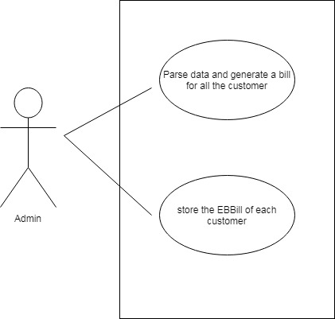
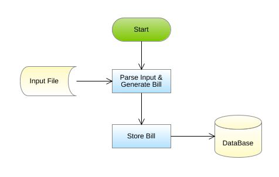

# Electricity Bill

## Introduction

The State Electricity Board was finding it tough to deal with the billing process of their domestic consumers. Validating the consumer number, making a note of  the respective units consumed, calculating the bill amount based on the units consumed, and other  processes were done manually  which was very time consuming.  So, the Electricity Board decides to out source the billing process of their domestic consumers to Global Tek Software Company. Help the Global Tek to automate the above task.

The Electricity Board has the following business processes that must be automated.

1. Parse data and generate a bill for all the customer
2. Store the ElectricityBill of each customer

## Requirements 

### Functional Requirements

| Sl No | Requirement Name | Requirement Description | Users | Comments | 
| ----- | ---------------- | ----------------------- | ----- | -------- |
| 1 | Parse data and generate  bill for all the customer | The units consumed and the other details of the customer are stored in a flat file. Retrieve the data from the file and generate a bill for each customer based on the units consumed | Admin | The admin of the electricity board is reponsible for parsing the data and generating the bill for all the customers | 
| 2 | Store the ElectricityBill of each customer | After generating the bill the electricity board will store the ElectricityBill of each customer in a database. | Admin | The admin of the electricity board is responsible for adding the ElectricityBill of each customer into the database. | 

### Use Case Diagram

    

### System Architecture Diagram

    

## Design Secification

### Data Design

#### Table Structure

Table name **AnnualRAinfall**

| Column Name | Data Type |
| ----------- | --------- | 
| consumer_number | varchar(15) primary key |
| name | varchar(25) | 
| address | varchar(30) |
| units_consumed | int(5) |
| bill_amount | float(6, 2) |

#### Design Constrains

To create the table in your local machine, use the script **script.sql**.

The table names and the column names should be the same as specified in the table structure.

Database connections should be configurable; it should not be hard coded. The database information is specified in the “db.properties” file, which is also provided as part of the code skeleton.

### Component Design for identified Use Cases

#### Parse data and generate bill for all the customer

The units consumed  and the other details of the customer are stored in a flat file. Retrieve the data from the file and generate bill for each customer based on the units consumed. The details of the customer are stored in a file named `ElectricityBill.txt`.

Sample File containing customer details. The file is comma delimited.

**ElectricityBill Format:**

    consumerNumber,Name,address,UnitsConsumed

**Demo Data**

    0191919191,John,Chennai,650
    0191919192,Peter,Mumbai,1100
    1919191919,Rose,Mumbai,453
    0191919193,Tom,Hyderabad,750
    01919191945,Raj,Chennai,120
    0191919194,Sam,Chennai,250
    0191919195,Anya,Chennai,34

From the ElectricityBill.txt file, read the details , parse the data and construct an ElectricityBill object for each record in the file, then calculate the bill amount for each ElectricityBill based on theconditions given below:

| Units Consumed | Rate per unit in rupees | 
| :------------- | :---------------------: |
| <= 100 | Free |
| > 100 and <= 300 | 1.5 |
| > 300 and <= 600 | 3.5 |
| > 600 and <= 10000 | 5.5 |
| > 1000 | 7.5 |

>**For example:** 
If the units Consumed is 650, then the first 100 units are free and for the next 200 units the charges are 1.50/unit, for next 300 units the charges are 3.50/unit and for the remaining 50 units the charges are 5.5 /unit.  
The total bill amounts to  
`1625 = (0 (first 100 free then) + 200 * 1.50 + 300 * 3.50 + 50 * 5.5)`

          
After calculating the bill amount store all the EBill object into a list.

**Validation:**

The consumerNumber should start with zero and it should contain 10 digits. If the consumerNumber is valid then parse the data and calculate the bill amount else throw a user defined Exception “**InvalidConsumerNumberException**” with a message "Invalid Consumer Number". 

>**Note:** 
This functionality is about only reading the records from the file, parsing each record data, validating the consumerNumber, creation of ElectricityBill object and then storing the ElectricityBill Object into the list and return the list. This functionality does not deal with DB Connectivity.

**Component Specification: ElectricityBill(model class)**

| Component Name | Type (Class) | Attributes | Methods | Responsibilities | 
| -------------- | ------------ | ---------- | ------- | ---------------- | 
| Parse data and generate a bill for all the customers | ElectricityBill | String consumerNumber  String consumerName  String consumerAddress  int unitsConsumed  double billAmount | Include getters and setter method for all the attributes. |  | 
| Parse data and generate a bill for all the customers | ElectricityBill |  | `void calculateBillAmount()` | This method should calculate and set the bill amount based on the units consumed. |

**ElectricityBoard(utility class)**

| Component Name | Type (Class) | Attributes | Methods | Exception | 
| -------------- | ------------ | ---------- | ------- | ---------------- |
| Parse data and generate a bill for all the customers | ElectricityBoard | `List<ElectricityBill> generateBill(String filePath)` | This method takes the file path as argument and it should parse the data stored in the fileand it should validate the consumer number by invoking the validate() method, if valid,construct a ElectricityBill object for each record in the file, then calculate the bill amount by invoking the calculateBillAmount method of ElectricityBill class. After calculating the bill amount, each ElectricityBill should be added into the list and this method should return the list of ElectricityBill. |  |
| Parse data and generate a bill for all the customers | ElectricityBoard | `booleanvalidate(String consumerNumber)` | This method should validate the consumerNumber, if valid return true else this method should throw an user defined exception. | Throw a user defined exception "**InvalidConsumerNumberException**" if the consumer number is invalid. | 

#### Store the ElectricityBill of each customer

After generating the bill ,the electricity board will store the ElectricityBill of each customer into the database.

> **Note:** 
Script file contains the DDL statement for creating the needed table in the database. This script is needed for implementing this functionality. So, when working with Eclipse, copy and paste the script in your local database and then implement the requirement and test your code.

**ElectricityBill(model class)**

| Component Name | Type (Class) | Attributes | Methods | Responsibilities | 
| -------------- | ------------ | ---------- | ------- | ---------------- | 
| Store the units consumed by each customer | ElectricityBoard | `void addBill(List<ElectricityBill> billList)` | This method should add all the ElectricityBill details into the ElectricityBill table. Connect to the database by invoking the establishConnection() method of DBHandler class. | MYSQL database is used. Store the details into ElectricityBill table | 

**DBHandler(DAO Class)**

| Component Name | Type (Class) | Attributes | Methods | Responsibilities | 
| -------------- | ------------ | ---------- | ------- | ---------------- | 
| Store the units consumed by each customer | DBHandler | Connection establishConnection() | This method should connect to the database by reading the database details from the db.properties file and it should return the connection object | MYSQL database is used. Store and retrieve the details into/from ElectricityBill table. db.properties file is used to store the database configuration details. | 

> **Note** 
*When working with IDE, please change the values of db.classname, db.url, db.username, db.password according to your MYSQL Configuration.*