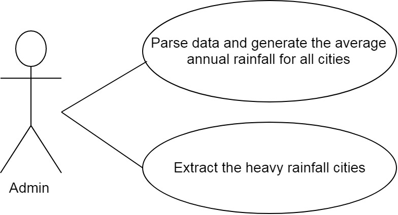
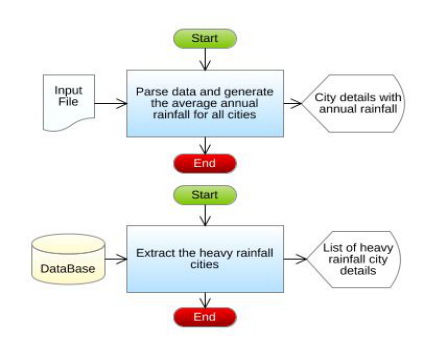

# Rainfall Report Automation

## Introduction

The Meteorological Department did an analysis of the rainfall in different cities over a period of one year. They had a bunch of records which had the average monthly rainfall of every month in all those cities. As a result of their analysis, they needed to generate a report of the cities which received heavy rainfall by calculating the average annual rainfall based on each city manually. To do away with the manual tasks, they now want to automate all the above-mentioned processes. Help them to automate this report generation process.

The Meteorological Department has the following tasks that must be automated.

1. Parse data and calculate the average annual rainfall of all the cities.
2. Extract the names of the cities with heavy rainfall.

## Requirements

### Functional Requirements

| Sl No | Requirement Name | Requirement Description | Users | Comments | 
| ----- | ---------------- | ----------------------- | ----- | -------- |
1 | Parse data and calculate the average annual rainfall of all cities | The average monthly rainfall in each city and the other details of the city are stored in a flat file. Retrieve the data from the file and calculate the average annual rainfall for each city based on its monthly rainfall. | Admin | The admin of the meteorological department is responsible for parsing the data and calculating the average annual rainfall for all the cities | 
| 2 | Extract the names of the cities with heavy | The average annual rainfall of each city is stored in the database, the meteorological retrieving the average annual rainfall of each city from the database and Identifying the cities with the maximum rainfall | Admin | The admin of the meteorological department is responsible for retrieving the average annual rainfall of each city from the database and Identifying the cities with the maximum rainfall |

### Use Case Diagram

    

### System Architecture Diagram

    

## Design Secification

### Data Design

#### Table Structure

Table name **AnnualRAinfall**

| Column Name | Data Type |
| ----------- | --------- | 
| city_pincode | int(5) | 
| city_name | varchar(25) |
| average_annual_rainfall | double(6, 2) | 

#### Design Constrains

To create the table in your local machine, use the script **script.sql**.

The table names and the column names should be the same as specified in the table structure.

Database connections should be configurable; it should not be hard coded. The database information is specified in the “db.properties” file, which is also provided as part of the code skeleton.

### Component Design for identified Use Cases

#### Parse data and generate the average annual rainfall for all cities

The average monthly rainfall in each city and the other details of the city are stored in a flat file. Retrieve the data from the file and calculate the average annual rainfall of each city based on its monthly rainfall. The details of the cities with the rainfall details are stored in a file named `AllCityMonthlyRainfall.txt`.

Sample File containing rainfall details. The file is comma delimited.

**AllCityMonthlyRainfall Format:**

    cityPincode,cityName,JanRainfall,FebRainfall,MarRainfall,AprRainfall,MayRainfall,JunRainfall,JulRainfall,AugRainfall,SepRainfall,OctRainfall,NovRainfall,DecRainfall

**Demo Data**

    10002,New York,24,15,17,16,11,10,9,4,24,36,40,32
    99501,Alaska,14,24,36,40,27,16,15,34,15,10,9,32
    20019,Washington,11,20,12,20,10,15,20,21,19,10,11,12
    30381,Atlanta,25,26,23,20,21,22,21,21,20,19,18,11
    27565,Oxford,6,7,11,14,9,8,14,15,9,9,10,11
    85054,Phoenix,12,11,12,11,10,14,15,14,15,12,10,9
    90080,Los Angeles,6,5,4,5,4,5,6,8,4,5,9,4

From the AllCityMonthlyRainfall.txt file, read the details, parse the data and construct an AnnualRainfall object for each record in the file, then calculate the averageAnnualRainfall of each city based on the conditions mentioned below:

Average Annual Rainfall = (sum of all monthly rainfall of a city)/number of months

>**For example:** 
If the city has a monthly rainfall as 
30, 15.5, 12, 10, 15, 20.9, 21, 22, 20, 18.6, 15, 10
then the averageAnnualRainfall will be  (30+15.5+12+10+15+20.9+21+22+20+18.6+15+10) / 12, which is 210 / 12 = 17.5  Therefore, the averageAnnualRainfall of that city is 17.5. After calculating the averageAnnualRainfall, store all the AnnualRainfall object into a list.

**Validation:**

The city Pincode should contain exactly 5 digits. If the city Pincode is valid then parse the data and calculate the average annual rainfall else throw a user defined Exception “InvalidCityPincodeException” with a message "**Invalid City Pincode**".

> **Note** 
*This functionality is about only reading the records from the file, parsing each record data, validating the cityPincode, creation of AnnualRainfall object and then storing the AnnualRainfall Object into the list and return the list. This functionality does not deal with DB Connectivity.*

**AnnualRainfall(model class)**

| Component Name | Type (Class) | Attributes | Methods | Responsibilities | 
| -------------- | ------------ | ---------- | ------- | ---------------- | 
| Parse data and calculate the average annual rainfall of all cities | AnnualRainfall | int cityPincode  String cityName  double averageAnnualRainfall | Include getters and setter method for all the attributes |  | 
| Parse data and calculate the average annual rainfall of all cities | AnnualRainfall |  | `void calculateAverageAnnualRainfall(double[] monthlyRainfall)` | This method should calculate and set the averageAnnualRainfall based on the monthly rainfall the city received | 

**RainfallReport(utility class)**

| Component Name | Type (Class) | Attributes | Methods | Responsibilities | 
| -------------- | ------------ | ---------- | ------- | ---------------- | 
| Parse data and calculate the average annual rainfall of all cities | RainfallReport | `List<AnnualRainfall> generateRainfallReport(String filePath)` | This method takes the file path as argument and it should parse the data stored in the file and it should validate the city Pin code by invoking the validate() method, if valid, construct an AnnualRainfall object for each record in the file, then calculate the average annual rainfall by invoking the `calculateAverageAnnualRainfall(double[] monthlyRainfall)` method of AnnualRainfall class. After calculating the averageAnnualRainfall, each AnnualRainfall should be added into the list and this method should return the list of AnnualRainfall. |  | 
| Parse data and calculate the average annual rainfall of all cities | RainfallReport | `boolean validate(String cityPincode)` | This method should validate the city pincode, if valid return true else this method should throw an userdefined exception. | Throw a user defined exception “**Invalid CityPincode Exception**” if the pincode is invalid. | 

> **Note** 
*Throw a user defined exception “Invalid CityPincode Exception” if the pincode is invalid.*

#### Extract the names of the cities with heavy rainfall 

The averageAnnualRainfall of each city is stored in the database, the meteorological department will find the maximumRainfall value and display the city details which received the maximumRainfall from the database.

> **Note** 
*Script file containing the records are for implementing this requirement only. So copy and paste the records when working with IDE and then implement the requirement and test your code.*

**RainfallReport(utility class)**

| Component Name | Type (Class) | Attributes | Methods | Responsibilities | 
| -------------- | ------------ | ---------- | ------- | ---------------- | 
| Extract the names of the cities with heavy rainfal | RainfallReport | `List<AnnualRainfall> findMaximumRainfallCities ()` | This method should extract all the AnnualRainfall details from the AnnualRainfall table and return the list of cities with maximum averageAnnualRainfall. Connect to the database by invoking the establishConnection() method of DBHandler class. | MYSQL database is used. Retrieve the details from  AnnualRainfall table. |
| Extract the names of the cities with heavy rainfall | DBHandler | `Connection establishConnection()` | This method should connect to the database by reading the database details from the db.properties file and it should return the connection object | MYSQL database is used. Store and retrieve the details into/from AnnualRainfall table. `db.properties` file is used for storing the database details. | 

> **Note** 
*When working with IDE, please change the values of db.classname, db.url, db.username, db.password according to your MYSQL Configuration.*