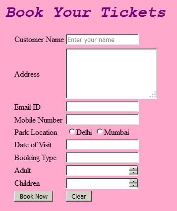
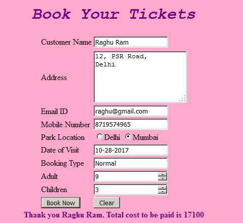

# DREAM Theme Park Ticket Booking Automation

Check out the live demo [here](https://book-your-ticket-ritam.glitch.me/).

## Introduction

Dream Theme park is a famous amusement park that attracts lot of people everyday. The queue outside the ticket counter is usually long and people wait long  to get their tickets.So in order to help their visitors save on their time and energy, the theme park wants to automate its booking process so that the visitors can book the tickets online from the official website. All that the visitors need to do is log on to the website and provide their details. 

Dream Theme Park Automation wants to design a web page for the ticket booking  that requires the visitors to provide their details. Create a Web page “Book Your Tickets” that has the following fields such as name, address, email, mobile number along with the location of the theme park, date of visit and number of people visiting the theme park.  Also booking type needs to be entered.  It can be either Normal or School or Corporate. The styles have to be applied using CSS3 and the Ticket amount validated and displayed in Javascript.

## Functional Requirements

 <table>
    <thead>
        <tr>
            <th>Sl No</th>
            <th>Requirement Name</th>
            <th>Requirement Description</th>
        </tr>
    </thead>
    <tbody>
        <tr>
            <td>1</td>
            <td>Design a Web page “Book Your Tickets” with the specified fields.</td>
            <td>
                <table>
                    <thead>
                        <tr>
                            <th>Label Name</th>
                            <th>Component Name</th>
                            <th>Componenet Id</th>
                            <th>Description</th>
                        </tr>
                    </thead>
                    <tbody>
                        <tr>
                            <td>Customer Name</td>
                            <td>customerName</td>
                            <td>customerName</td>
                            <td>
                                
To enter the name of the customer.

                                
<strong>It should be mandatory.</strong>

                            </td>
                        </tr>
                        <tr>
                            <td>
                                Address
                            </td>
                            <td>
                                address
                            </td>
                            <td>
                                address
                            </td>
                            <td>
                                
To enter the address of the customer. 

                                
<strong>Provide the correct tag and attribute to create a text area with  5 rows
                                        and 20
                                        columns.
                                        It should be mandatory.</strong>

                            </td>
                        </tr>
                        <tr>
                            <td>Email ID</td>
                            <td>customerEmail</td>
                            <td>customerEmail</td>
                            <td>
                                
To enter the email of the customer.

                                
Use type=”email” or type=”text. If you use type=”text”,use “pattern” attribute
                                    along with
                                    it.

                                
<strong>It should be mandatory.</strong>

                            </td>
                        </tr>
                        <tr>
                            <td></td>
                            <td></td>
                            <td></td>
                            <td></td>
                        </tr>
                        <tr>
                            <td>Mobile Number</td>
                            <td>customerMobileNumber</td>
                            <td>customerMobileNumber</td>
                            <td>
                                
To enter the mobile number.

                                

                                    Use type=”tel” or type=”text or type=”number”. If you use type=”text” or
                                    type=”number”use “pattern” attribute to accept whether the 10 digit mobile no
                                    starts
                                    with either one of the following numbers:
                                

                                6,7,8 or 9
                                
<strong>
                                        It should be mandatory.
                                    </strong>

                            </td>
                        </tr>
                        <tr>
                            <td>Park Location</td>
                            <td>location</td>
                            <td>
                                
locationMumbai

                                
locationDelhi

                            </td>
                            <td>
                                

                                    Select the Park location. Use two locations Mumbai and Delhi.
                                

                                
<strong>Provide the correct input type to make this component a radio
                                        button.</strong>
                                

                                
<strong>It should be mandatory.</strong>

                            </td>
                        </tr>
                        <tr>
                            <td>Date of Visit</td>
                            <td>dateOfVisit</td>
                            <td>dateOfVisit</td>
                            <td>
                                
To select the date of visit.

                                
Use type=”date” or type=”text. If you use type=”text”,use “pattern” attribute to
                                    accept
                                    the dateOfVisit in the following format :

                                
mm/dd/yyyy

                                
<strong>It should be mandatory.</strong>

                            </td>
                        </tr>
                        <tr>
                            <td>Booking Type</td>
                            <td>bookingType</td>
                            <td>bookingType</td>
                            <td>
                                
An auto-complete feature should be available to the user for the following
                                    options.

                                
<strong>Normal, School, Corporate</strong>

                                
<strong>(Use DataList “bookType” to make use of auto-complete feature with option
                                        Normal,School,Corporate).</strong>

                                
<strong>It should be mandatory.</strong>

                            </td>
                        </tr>
                        <tr>
                            <td>
                                Adults
                            </td>
                            <td>
                                adults
                            </td>
                            <td>
                                adults
                            </td>
                            <td>
                                
To enter the number of adults.

                                
<strong>Provide the input type so that this field accepts only digits.</strong>
                                

                                
<strong>Set minimum value as 0 and maximum value as 500. It should be
                                        mandatory.</strong>
                                

                            </td>
                        </tr>
                        <tr>
                            <td>Children</td>
                            <td>children</td>
                            <td>children</td>
                            <td>
                                
To enter the number of children.

                                
Provide the input type so that this field accepts only digits. 

                                
<strong>It should be mandatory.</strong>

                            </td>
                        </tr>
                        <tr>
                            <td>Book Now</td>
                            <td>submit</td>
                            <td>submit</td>
                            <td>The input type submit must be used.</td>
                        </tr>
                        <tr>
                            <td>Clear</td>
                            <td>reset</td>
                            <td>reset</td>
                            <td>
                                
Reset Button.  On clicking this button, all fields should be reset.

                                
Provide the input type for this component.

                            </td>
                        </tr>
                    </tbody>
                </table>
                NOTE: The text highlighted in bold in the Description needs to be implemented in the code to
                complete the web page design. Use the Label Name, Component Name and Component Id as given
                All validations should be based on HTML 5 (Do not use Javascript). All the fields are mandatory
            </td>
        </tr>
        <tr>
            <td>2</td>
            <td>Apply the mentioned styles using CSS to the components.</td>
            <td>
                <ol>
                    <li>Body color should be “#FFAACC”.</li>
                    <li>The heading should be done using <strong>h1</strong> tag, the text color should be “#770080”, font should
                        be “Courier New”, style should be “italic” and it should be aligned to the center of the
                        webpage.</li>
                    <li>The result should be bold and color of the text should be #770080</li>
                </ol>
                
Note: Fill in the  style tag so that the given styles are applied to the components.
                    (Do not use Inline CSS)

            </td>
        </tr>
        <tr>
            <td>3</td>
            <td>Use JavaScript for calculating the total amount of tickets</td>
            <td>Use JavaScript for doing the following calculation: 
                Customer on entering the valid values and clicking the submit button the total amount should be
                calculated based on the assumptions given:
                Ticket cost per Adult : Rs. 1500
                Ticket cost per Child : Rs. 1200
                If Booking Type is Normal, no discount is provided.
                If Booking Type is School, 50% discount is provided on the total ticket cost
                If Booking Type is Corporate, 25% discount is provided on the total ticket cost
                Hence Total cost = Total Ticket Cost  -  discount
                The result should exactly match with the following message:
                “Thank you customer name. Total cost to be paid is total cost”  in a div tag  with   id  “result”.
                Note: Use getElementsByName or getElementById function to retrieve the values
                Substitute customer name with the value of the customerName field.
                Substitute total cost with the calculated total cost.</td>
        </tr>
        <tr>
            <td>4</td>
            <td>form Tag with attribute onsubmit </td>
            <td>form Tag is already given in the code template. Do not change the code template and do the coding as
                per requirement and specification.
                Make sure that the onsubmit attribute in the form tag is invoking the JavaScript function like
                "return calculateCharges()".
                Also ensure that “return false;” statement is the last line of the JavaScript function
                “calculateCharges()”. </td>
        </tr>
    </tbody>
</table>

## Desgin Specification

### UI Design

1. The Simgple web page should look as follows

    

2. And on providing the values the web page should look as follows:

    

### General Seign Constrains

1. The label name and the component name should be correctly specified as given in the document. Validation of all the fields should be based on HTML 5 (Do not use Javascript). All the fields are mandatory. 
2. For the Styles, do not use Inline CSS.3. For Javascript, use `getElementsByName` or `getElementById` function to retrieve the values