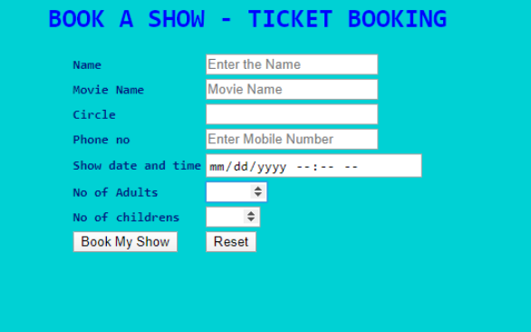
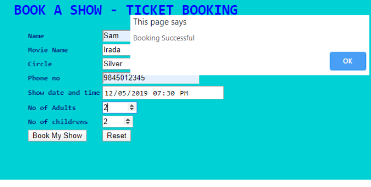

# Book A Show - Online Ticket Booking

Check out the live demo [here](https://book-a-show-ritam.glitch.me/)

“BOOK A SHOW” is an online movie ticket system to book tickets for current and upcoming movie releases across the city in India. The user can select the movie and preferred circle and the ticket details while booking the ticket.

Create a web page ticket.html to accommodate details that will be entered by the user such as name, movie name, circle (Silver, Gold or Platinum), phone number, showdate, number of adults and children. On submission of the form, an alert box should be displayed with a message "Booking Successful” and it needs to remain on the same page.

The web page should look like

> Sample Webpage:

> The outcome webpage should look as

<table>
<thead>
<tr>
<th>Req. #</th>
<th>Req. Name</th>
<th>Req. Description</th>
</tr>
</thead>
<tbody>
<tr>
<td style="vertical-align: top;">1</td>
<td style="vertical-align: top;">Design a Web page “ticket.html” with the specified fields.</td>
<td>
<table>
<thead>
<tr>
<th>Label Name</th>
<th>Component Name</th>
<th>Description</th>
</tr>
</thead>
<tbody>
<tr>
<td>Name</td>
<td>name</td>
<td>To enter the name. It is a mandatory field and should be validated. Should not allow
any special characters other than space.</td>
</tr>
<tr>
<td>Movie Name</td>
<td>moviename</td>
<td>An auto-complete feature should be available to the user for the following
options. Irada, Rangoon, Logan, Fist Fight. (Name of the auto-complete feature
should be “movies”)</td>
</tr>
<tr>
<td>Circle</td>
<td>circle</td>
<td>An auto-complete feature should be available to the user for the following
options. Silver, Gold, Platinum. (Name of the auto-complete feature should be
“circles”)</td>
</tr>
<tr>
<td>Phone no</td>
<td>phone</td>
<td>To enter the phone number. Should validate for numeric digits. Should contain 10
digits.</td>
</tr>
<tr>
<td>Show date and time</td>
<td>showdate</td>
<td>Date time picker control to choose the date and time of the show. Use the input type
as datetime-local</td>
</tr>
<tr>
<td>No of Adults</td>
<td>tickets</td>
<td>Choose the number of adults. An input of type number that can have a minimum value
of 1 and maximum value of 10.</td>
</tr>
<tr>
<td>No of childrens</td>
<td>children</td>
<td>Choose the number of children. An input of type number that can have a minimum value
of 1 and maximum value of 5.</td>
</tr>
<tr>
<td></td>
<td>submit</td>
<td>An input type of submit that has a value as Book My Show. On submission of the form,
an alert box should be displayed with a message &quot;Booking Successful” and it
needs to remain on the same page</td>
</tr>
<tr>
<td></td>
<td>reset</td>
<td>An input type of reset that has a value as Reset. On clicking this button, all
fields should be reset</td>
</tr>
</tbody>
</table>
</td>
</tr>
<tr>
<td></td>
<td></td>
<td><strong>
NOTE: Use the Label Name and Component Names as given All validations should be based on HTML
5 
(Do not use Javascript). All the fields are mandatory
</strong></td>
</tr>
<tr>
<td style="vertical-align: top;">2</td>
<td style="vertical-align: top;">Apply the mentioned styles using CSS to the components.</td>
<td>
<ol>
<li>Use a table element to render the form elements. The table element will have a style of
font-family as monospace and font-weight as bold</li>
<li>The h1 element should have color as #0000FF and font-family as monospace and text needs to
be center aligned</li>
<li>The body background color should be #00CED1.</li>
<li>The text color should be #0C1584.</li>
</ol>
<strong>Node: (Do not use Inline CSS)</strong>
</td>
</tr>
</tbody>
</table>

> Note: 

- Do not use Inline CSS  
- Make sure all tags and attributes are in lower case

