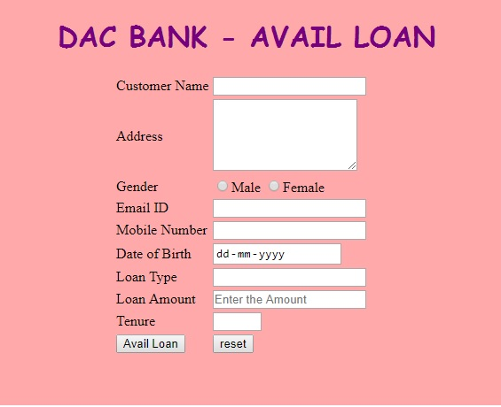

# DAC Bank Loan Automation

DAC Bank is in the process of issuing various loans to its customers. To ease the customer requirements, they need to automate the feature of various loans issued by the bank like Vehicle, Home, Education loan etc.

Create a Web page “availLoan.html” that accepts the fields such as Customer name, address, gender, email id, mobile number, date of birth, loan type, loan amount and tenure. The form needs to display the output message with the loan amount on clicking the Avail Loan submit button, and the form needs to remain in the same page.

The web page should look like

> Sample Webpage:

> On providing the values the web page should look as follows :

# The requirements are as follows

<table>
<thead>
<tr>
<th>Req. #</th>
<th>Req. Name</th>
<th>Req. Description</th>
</tr>
</thead>
<tbody>
<tr>
<td>1</td>
<td>Designing a Web page “availLoan” with the specified fields.</td>
<td>
<table>
<thead>
<tr>
<th>Label Name</th>
<th>Component Name</th>
<th>Description</th>
</tr>
</thead>
<tbody>
<tr>
<td>Customer Name</td>
<td>customerName</td>
<td>To enter the name of the customer. It should not be empty, and contain only alphabets and space  and it is a mandatory field</td>
</tr>
<tr>
<td>Address</td>
<td>customerAddress</td>
<td>To enter the address of the customer. Use textarea with 5 rows and 20 columns.</td>
</tr>
<tr>
<td>Gender</td>
<td>gender</td>
<td>To choose the gender. Use Radio Button. Gender should be either ‘Male’ or ‘Female’.</td>
</tr>
<tr>
<td>Email ID</td>
<td>customerEmail</td>
<td>To enter the email of the customer. Use HTML5 component so that this field accepts only valid Email ID. A valid id can be given as abc@sample.com which contains an email prefix, followed by @, and followed by a domain name.</td>
</tr>
<tr>
<td>Mobile Number</td>
<td>customerMobileNumber</td>
<td>To enter the mobile number. Customer Mobile Number should be of 10 digits and should start with 9/8/7. </td>
</tr>
<tr>
<td>Date of Birth</td>
<td>dob</td>
<td>To select the date of birth. Use date type.</td>
</tr>
<tr>
<td>Loan Type</td>
<td>loanType</td>
<td>An auto-complete feature should be available to the user for the following options. Vehicle, Home, Education (ID of the auto-complete feature should be “loan”. Use Datalist for this feature)</td>
</tr>
<tr>
<td>Loan  Amount</td>
<td>loanAmount</td>
<td>To enter the loan amount. The text “Enter the Amount” should be displayed by default in the text box. When the user starts entering the amount, this text should disappear. It is a mandatory field.</td>
</tr>
<tr>
<td>Tenure</td>
<td>loanTenure</td>
<td>To enter the period of loan. Use number type. Tenure can take a value between 1 and 5.</td>
</tr>
<tr>
<td></td>
<td>submit</td>
<td>A submit button. An input type of submit having a value of Avail Loan. Once submitted, the web page displays the output message with the loan amount, as will be described in the Java script section that will follow below.</td>
</tr>
<tr>
<td></td>
<td>reset</td>
<td>A reset button. An input type of reset, on clicking this button, all fields should be reset.</td>
</tr>
</tbody>
</table>
 NOTE: Use the Label Name  and Component Names as given. All validations should be based on HTML 5 (Do not use Javascript).</td>
</tr>
<tr>
<td>2</td>
<td>Applying the mentioned styles using CSS to the components.</td>
<td><ol>
<li>Body color should be &quot;#FFAACC&quot;.</li>
<li>The heading should be done using <code>&lt;h1&gt;</code> tag the text color should be &quot;#770080&quot;, font family should be &quot;cursive&quot; and it should be aligned to center of the webpage.</li>
<li>The result should be bold and color of the text should be &quot;#770080&quot;.</li>
</ol>
 Note: (Do not use Inline CSS)</td>
</tr>
<tr>
<td>3</td>
<td>Use JavaScript for displaying the loan amount.</td>
<td>Customer on entering valid values and clicking the submit button displays the output message as &quot;Thank you <code>customerName</code>. Your Loan Amount is <code>loanAmount</code>&quot;  in a div tag with id  &quot;result&quot;. After the output message is displayed, it needs to remain on the same page.  Note: Use getElementsByName or getElementById function to retrieve the values.</td>
</tr>
</tbody>
</table>

### Note: 

Make sure all tags and attributes are in lower case
