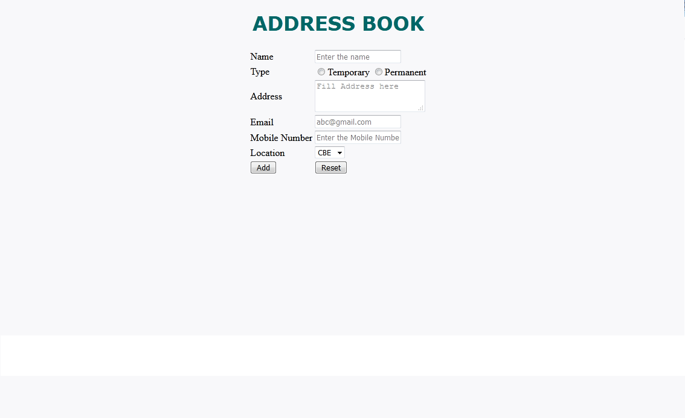

# Address Book - New

Address Book Form is developed for College alumnus to add their Address detail for them to communicate with each other .  More than one person can Add Address to Address Book. They can see the Address details which they provided in web portal on submitting.  For this they want to design a webpage "addressbook.html" with following fields:

> Note: 

Every tag has been given a mark. Make sure the element names are correct

| SNO | LABEL NAME | COMPONENT NAME AND ID | DESCRIPTION | 
| --- | ---------- | --------------------- | ----------- |
| 1 | Name | name | To enter the name of the person. The text “Enter the name” should be displayed by default in the text box. While entering the name, this text should disappear | 
| 2 | Type | type | The address type are displayed in radio button and the type are Temporary and Permanent. Have the type id attributes as type1, and type2 respectively. |
| 3 | Address | address | The address can be taken multiple lines. |
| 4 | Email | email | To enter the email-id of the customer. The text “abc@gmail.com" should be displayed by default in the text box. While entering the e-mail, this text should disappear. This field should accept a valid email. |
| 5 | Telephone/ Mobile Number | mobile | To enter the mobile number. The text “Enter the Mobile Number" should be displayed by default in the text box. The mobile number should contain 10 digits and start with 9/8/7. |
| 6 | Location | location | Select the customer location using drop down with  id attribute as “Coimbatore”,"Chennai" and “Bangalore”. The attribute id needs to be location" | 
| 7 | Add | submit | On clicking this button, Address detail is displayed. |
| 8 | Reset | clear | On clicking this button, all fields should be reset. |

## RULES/CONSTRAINTS: 

All validations should be based on HTML 5 (Do Not use Java Script)

- The component name should be same as given above.

- All fields are mandatory.

- Name should contain only alphabets and space.

- Mobile Number should be of 10 digits and should start with 9/8/7.

- The Location are Coimbatore, Chennai and Bangalore.

### Use JavaScript for doing the below calculation:

On clicking the Add button, the details of the Address which is entered by the alumni is displayed below as shown in the Sample output below.

Constructor **`AddressRegister(Name,Type,Address,Email,Mobile,Location)`** for the Address Book form is already created.

Fill the codes which are commented inside the function **`displayAddress()`** to display the book detail.

Create a function displayAddress() to display the detail in a div tag. The div tag name should be **result**.
 

### Styles to be applied: (Do not use Inline CSS)

1. Body color should be **`#F8F8FA`**.
2. The heading ADDRESS BOOK should be done using `<h1>` tag and the text color should be#006666. Style should be verdana and it should be aligned to centre of the webpage.

> Sample Webpage:

> Output page:

