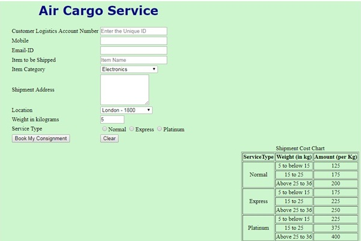
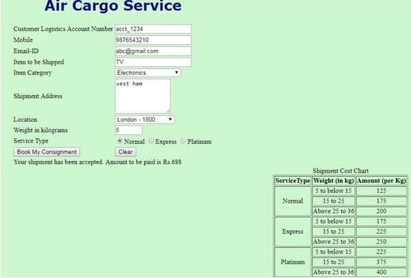

# Consignment Booking - New

Check out the live demo (here)[https://consignment-booking-ritam.glitch.me/].

FLY Logistics Ltd., is a leading company in cargo service. The company offers air cargo services from Mumbai to five international locations and vice versa. The registered customer will be able to book consignments along with the cargo details through their web portal.

As a HTML5 developer, you have been provided with the task of developing one webpage of this website. This module should contain the below page:

- **Book Consignment** – This will contain details that will be entered by the user to book a consignment.

> Note:  

Correctly specify the element name, as given in the requirement. All the HTML Tags should be given in lower case.

Book Consignment Page:

| SNO | LABEL NAME | Component Name | DESCRIPTION |
| --- | ---------- | -------------- | ----------- |
| 1 | Customer Logistics Account Number | accnumber | The text “Enter the Unique ID” should be displayed by default. When the user starts entering the value, this text should disappear. |
| 2 | Mobile | mobile | To enter the mobile number. |
| 3 | Email-ID | emailid | To enter the email of the customer. It should be “text”  type |
| 4 | Item to be Shipped | item | To enter the item name. “Item Name” text should be displayed by default in the text box. When the user starts entering the value this text should disappear. |
| 5 | Item Category | itemtype | The Dropdown should be displayed with the following options. Electronics, Attires, Toys, Non Poisonous Food. The Value of the Attribute  id should be “category” | 
| 6 | Shipment Address | address | To enter the shipment address. There should be a  textarea. |
| 7 | Location | location | The air mile distance from Mumbai to other locations should be available as follows. Dropdown should be displayed with the following options:  **London - 1800, Singapore - 1400, New York - 3100, Mexico City - 3300, Tokyo - 2800.** Name of the Attribute  id should be “category”. |
| 8 | Weight in kilograms | weight | Choose the weight using “number” type. Assume that the min value is 5 and max 36. For this component, set the id attribute value as **kilogramval** |
| 9 | Service Type | servicetype | Select the service type using radio buttons with the following values: Normal, Express, Platinum. Use  id attribute value as type1, type2, type3 respectively. |
| 10 | Book My Consignment | submit | On clicking this button, invoke Javascript called “costcalculation()”. The shipment cost should get displayed. |
| 11 | Clear | clear | On clicking this button, all fields should be reset. |

## RULES/CONSTRAINTS : 

- All validations should be based on HTML 5 
- All fields are mandatory.
- Customer Logistics Account Number should contain the combination of 4 alphabets followed by an underscore and end with 3-digits. It should be exactly 8 digits.

- Item to be shipped should contain only alphabets and space.

- Mobile Number should be of 10 digits and should start with 9 or 8 or 7.

 

### Sample WebPage

### On providing the values, the web page should look as follows:

## Styles to be applied: (Do not use Inline CSS)

1. Body color should be “#CEF6CE”.

2. For the shipment cost chart table, the border-style should be solid and it should be displayed on the right side(use float)of the webpage. The text inside the table should be aligned to center. (The table should have the id attribute with the value as “costtable”).
3. The heading should be done using `<h1>` tag and the text color should be **#08088A**, font-family should be **verdana** and it should be aligned to the centre of the webpage.
4. The font size of all tables should be 15px.

### Use JavaScript for doing the below calculation:

Name the Javascript as  `costcalculation()`

Customer on entering the valid values and clicking the submit button, the total amount has to be calculated and displayed as “Your shipment has been accepted. Amount to be paid is Rs.” ……… in a div tag. The div tag name should be “result”.

The amount should get rounded off to its nearest larger value.

Formula to calculate the shipment cost is = (Weight in Kg * Amount per Kg) + Tax

*****Refer Shipment Cost Chart in screen shot for Amount per Kg for shipment*****

Additionally the tax is applicable:

- London - 10% of the invoice amount

- Singapore – No tax

- New York - 15% of the invoice amount

- Mexico City – No tax

- Tokyo – 20% of the invoice amount

> Note:  

Specify the element names correctly, as given in the requirement. All your HTML tags should be given in lower case.
